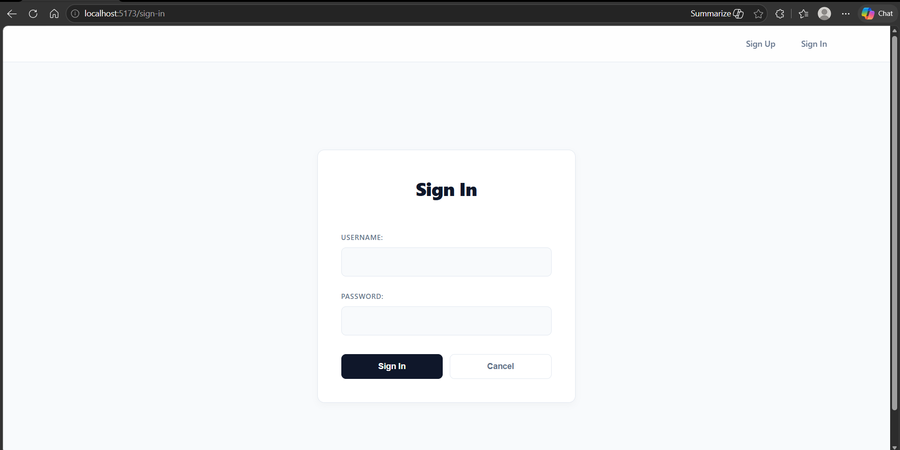
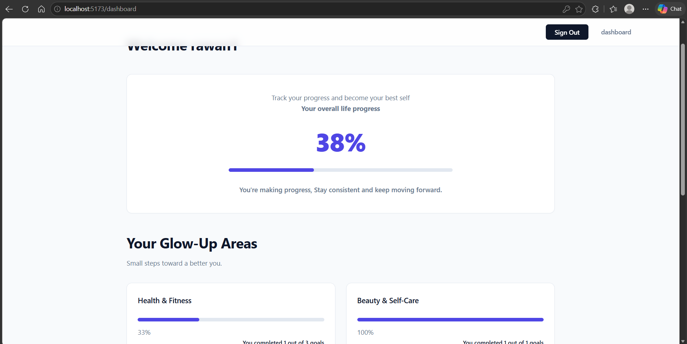
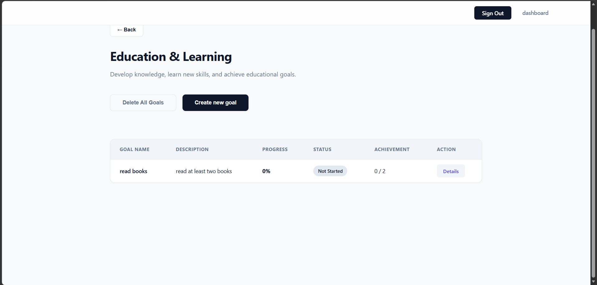
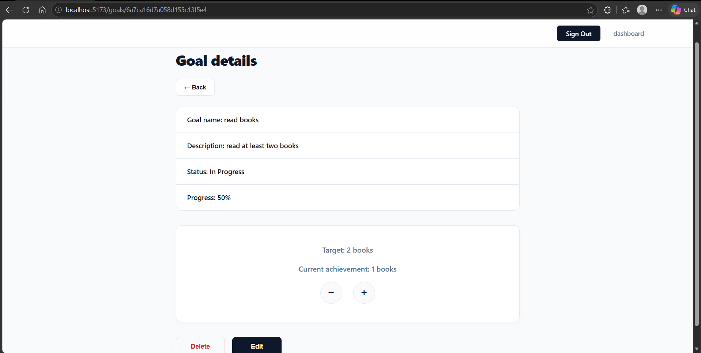
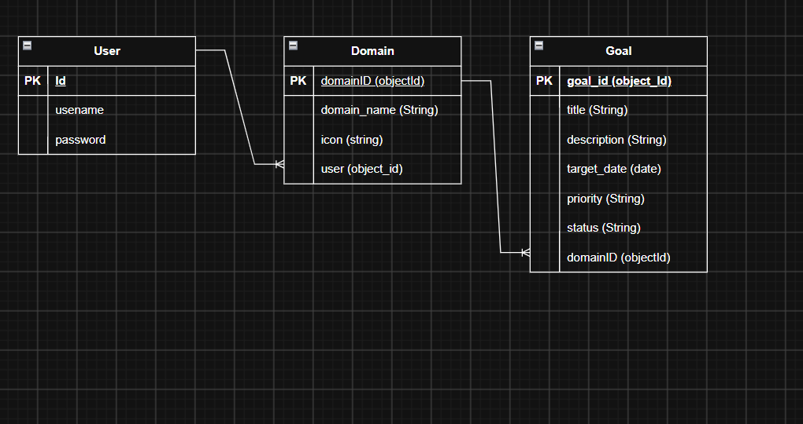

# Project Name
 A personal glow-up tracker system
## Overview
Life Glow Tracker is a personal goal-tracking web application that helps users organize and monitor their goals across different areas of life. Users can create, update, and delete goals, track their progress, and view their overall improvement through a personalized dashboard. The system supports both measurable and non-measurable goals, making personal growth easier to manage and visualize.
## Screenshots

## Technologies Used
 - Draw.io
- Frontend: React
- Backend: Node.js, Express.js
 - mongoDB
 - PostMan API

## User Stories

| Num | User Story                                                                                                                                |
|-----|-------------------------------------------------------------------------------------------------------------------------------------------|
| 1   | As a new visitor, I want to view a home page explaining the application, so that I understand its purpose.                                |
| 2   | As a new visitor, I want to sign up for an account, so that I can use the application.                                                    |
| 3   | As a registered user, I want to sign in, so that I can access my account.                                                                 |
| 4   | As a user, I want to view domain cards and progress summaries on the dashboard, so that I can monitor my overall life progress.           |
| 5   | As a user, I want to select a domain card, so that I can view and manage its goals.                                                       |
| 6   | As a user, I want to add simple or measurable/daily goals, so that I can track my objectives.                                             |
| 7   | As a user, I want to manage and update my goals, so that their progress and status are automatically tracked.                             |
| 8   | As a user, I want to receive feedback when I complete a goal, so that I feel motivated by my achievement.                                 |
| 9   | As a user, I want to update or delete goals, so that I can manage them effectively.                                                       |
| 10  | As a user, I want my domain and overall progress to update automatically after changing a goal, so that I can see my latest achievements. |

## Database Design

## Routes

| Method | Route        | Description                      |
|--------|--------------|----------------------------------|
| GET    | /            | Home page                        |
| GET    | /dashboard   | Dashboard                        |
| GET    | /domain/:id  | list all goals related to domain |
| POST   | /goals       | craete new goal                  |
| GET    | /goals/:id    | show goal details               |
| PUT    | /goals/:id   | update the goal                  |
| DELETE | /goals/:id   | delete one goal                  |
| DELETE | /goals       | delete all goals                 |
| GET    | /domains/:id | get one domain                   |

## Features
- User registration and authentication
- Personalized dashboard
- Predefined life domains
- Goal creation, viewing, updating, and deletion
- Measurable and non-measurable goals
- Automatic goal progress calculation
- Progress bars and percentage indicators
- Goal completion tracking
- Domain-based goal organization
- Overall life progress overview

## Future Enhancements
- Add reminders and notifications
- Allow users to create custom life domains.
- Add a calendar view for tracking goal deadlines.

## Credits

Special thanks to Mr. Omar kamal for his great support, guidance, and patience throughout the project.